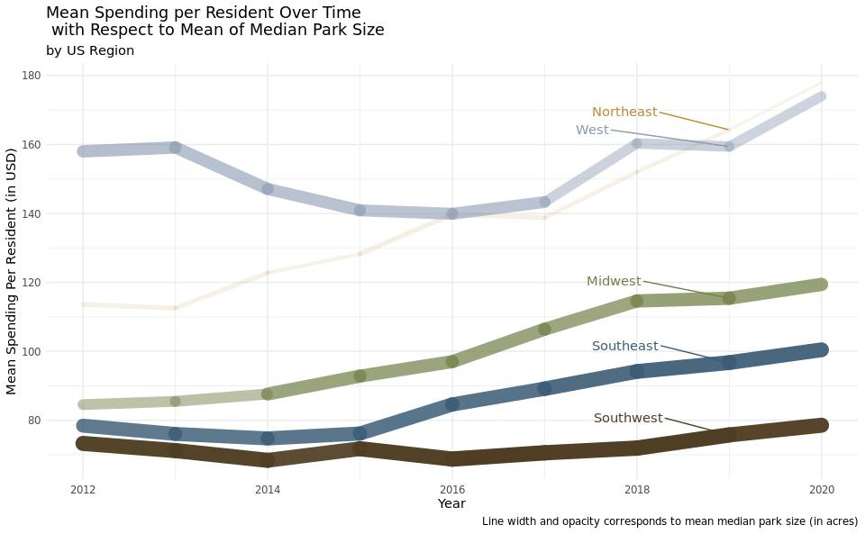
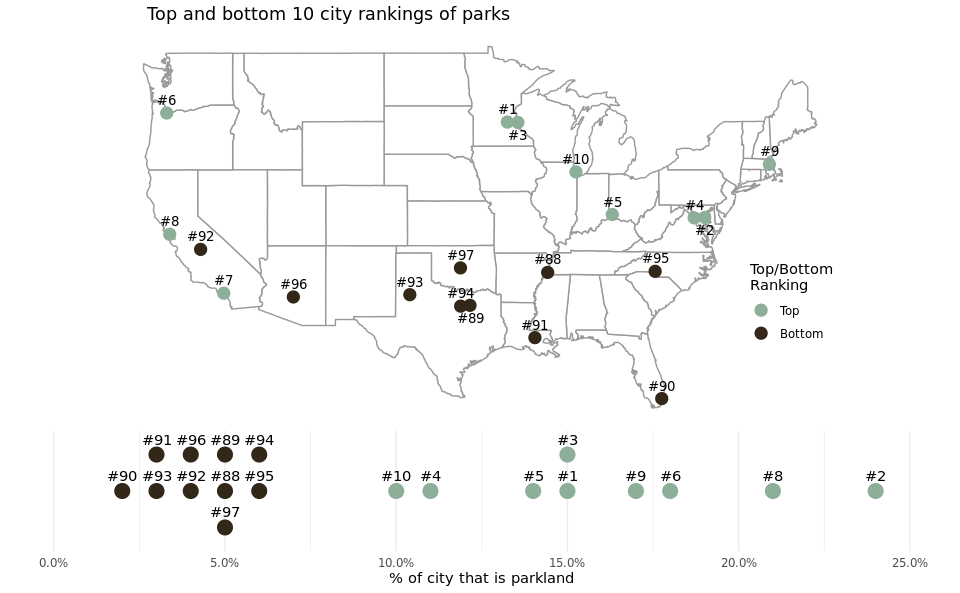

Quality of U.S. Public Parks
================
The Scatterplots

### Introduction

Our dataset comes from The Trust for Public Land’s ParkScore Index, an
annually released report which ranks the parks of the 100 most populated
cities in the United States according to 4 key metrics: access,
investment, amenities, and acreage. There are 713 rows and 28 columns in
the data set ranging from 2012 through 2020.

The COVID-19 Pandemic has laid bare a multitude of inequities that exist
in the United States. While many people were able to flock to their
local parks in order to get out of the house, many others were not. Our
group is interested in exploring the Parks Access dataset in order to
answer questions regarding access and equity to the nation’s largest
cities’ parks. The Citylab article accompanying the dataset from
TidyTuesday discussed a number of reasons for unequal access to quality
parks and we are hoping to explore these in our project.

## What is the relationship between spending per resident and park size in different U.S. regions and/or cities over time?

### Introduction

To answer our first question, we used the `parks` dataset and analyzed
the relationship between the variables `spend_per_resident_data`,
`city`, `med_park_size`, and `year`. We thought it would be interesting
to look into how city budgets have allocated money for spending on their
public parks and how this has varied across different US cities over the
course of nearly the last decade. We also wanted to analyze how spending
per resident and park size varies across different U.S regions and
cities. We wanted to explore the relationship between these variables in
light of the COVID-19 pandemic, where people across the US flocked to
their local public parks. Namely, we wanted to see if the relationship
was one we would expect- where the more money spent on parks per capita,
the higher the median park size would be.

### Approach

In order to ensure the final visualization had entries the variables of
interest for all years between 2012 and 2020, we did some data wrangling
first and removed all cities which had NAs for
`spend_per_resident_data`, `city`, and `med_park_size_data`. This left
us with a data frame with 4 columns: `spend_per_resident_data`, `city`,
`med_park_size_data`, and `year`. At this point, all that was left to do
was bin the data into quartiles for spending and for median park size.
In order to bin the data appropriately, we used the fivenum command to
find the quartiles in our data. This allowed us to analyze how spending
trends shifted between 2012 and 2020 for each quartile, as well as
visualize whether higher per capita spending resulted in larger median
park size. While we initially felt that a line graph would be
appropriate for this visualization, we quickly found that a line graph
yielded a plot that was overwhelming and uncompelling. As such, we
switched gears and decided to animate a scatterplot which allowed us to
visualize the quartiles for both size and spending next to each other
and see how these two things correlated to median park size and spending
over the span of 2012 and 2020.

For the second graph, we wanted to consider the variables of
`med_park_size_data` and `spend_per_resident` at the regional level as
opposed to city level. We hoped that this visualization would discern
differences between regions. To complete this goal, we first created a
new variable called `region` using `mutate` and `case_when`. We
referenced the National Geographic “United States Region” Map, which
resulted in 5 regions: West, Southwest, Midwest, Southeast, and
Northeast. After each city had a region connected with it in the
dataset, we grouped by year and region to complete the summarize
function. We then calculated the mean spending per resident for each
region during each year and the mean median park size for each region
during each year. We then plotted these means on a line plot over year
on the x-axis and mean spending per resident on the y-axis, grouped by
year. We used the size aesthetic to show the mean median park size
because it made aesthetic sense for a size-based variable to be mapped
to a size aesthetic. This yielded a lineplot, that we noticed had
similar features to the Napoleon plot.

### Analysis

``` r
### data wrangling
# to remove the $ and change from a categorical variable to a numerical variable 
# selected relevant variables, pivot wider to see what cities have data from every year
# drop na's from cities that do not have spending data from every year
# pivot longer to return dataset to a structure that can be plotted on a line plot

parks_q1 <- parks %>%
  select(year, city, spend_per_resident_data) %>% 
  mutate(across(starts_with("spend_per_resident_data"), ~gsub("\\$", "", .) 
                  %>% as.numeric)) %>% 
  pivot_wider(names_from = "year", 
              values_from = "spend_per_resident_data") %>% 
  drop_na() %>% #this is where we lose it 
  pivot_longer(cols = starts_with("20"),
               names_to = "year", 
               values_to = "spend_per_resident") 

#making the year variable numeric so we can join med_park_size_data back 
parks_q1 <- parks_q1 %>% 
  mutate(year = as.numeric(year))


#joining based on city and year to include med_park_size_data in the dataset
parks_q1 <- parks %>% 
  select(city, year, med_park_size_data) %>% 
  right_join(parks_q1, by = c("city","year")) 

fivenum(parks_q1$spend_per_resident)
```

    ## [1]  15  62  94 134 399

``` r
fivenum(parks_q1$med_park_size_data)
```

    ## [1]  0.8  3.0  4.8  7.3 16.7

``` r
#creating quartile bins for spending per resident, ranges based on five number summary
parks_q1 <- parks_q1 %>% 
  arrange(city) %>% 
  mutate(spending = case_when(
    between(spend_per_resident, 0, 62) ~ "1st quartile",
    between(spend_per_resident, 63, 94) ~ "2nd quartile",
    between(spend_per_resident, 95, 134) ~ "3rd quartile",
    TRUE ~ "4th quartile"
  ))

#creating quartile bins for median park size, ranges based on five number summary
  parks_q1 <- parks_q1 %>% 
    mutate(size = case_when(
    between(med_park_size_data, 0, 3.0) ~ "1st quartile",
    between(med_park_size_data, 3.01, 4.8) ~ "2nd quartile",
    between(med_park_size_data, 4.81, 7.3) ~ "3rd quartile",
    TRUE ~ "4th quartile"
  )) 

### plot of median park size vs spending per resident over time
  
q1_plot<- ggplot(parks_q1, aes(x = spend_per_resident, y = med_park_size_data, 
                               group = city)) + 
        geom_point(aes(size = size, color = spending)) +   
        labs(title = "Median Park Size vs. Spending Per Resident from 2012-2020 in 37 U.S. Cities",
             subtitle = "Year: {frame_time}",
             x = "Spending per Resident (USD)", 
             y = "Median Park Size (acres)", 
             size = "Park Size", 
             caption = "Quartiles for spending are $0-$62, $63-$94, $95-$134, and $135+ for 1st to 4th quartiles, respectively. 
Quartiles for size are 0-3.2 acres, 3.2-5.0 acres, 5.0-7.7 acres, 7.7+ acres for 1st to 4th quartiles respectively.",
             color = "Spending") +
        theme_minimal()+
        theme(plot.caption = element_text(size = 8, hjust = 0), 
              plot.title = element_text(size = 12), 
              legend.key.size = unit(.65, 'cm'), 
              legend.position = c(.9,.6)) +
        scale_x_continuous(breaks = seq(from = 0, to = 400, by = 50)) + 
        scale_y_continuous(breaks = seq(from = 0, to = 20, by = 5)) +
        scale_color_manual(values = c("#8999b0","#738148","#7c5d2d","#447aab")) +
        transition_time(as.integer(year), range = c(2012L, 2020L))

animate(q1_plot, duration = 18)
```

    ## Warning: Using size for a discrete variable is not advised.


``` r
# data wrangling
# mutate new variable `regions` based off what region the city is located in

parks_regions <- parks_q1 %>% 
  mutate(region = case_when(
         city %in% c("Boston", "Long Beach", "New York", "Philadelphia") ~
           "Northeast", 
         city %in% c("Atlanta", "Baltimore", "Jacksonville", "Louisville", 
                    "Memphis", "Nashville", "Virginia Beach") ~ "Southeast", 
         city %in% c("Chicago", "Columbus", "Detroit", "Kansas City", 
                     "Milwaukee") ~ "Midwest", 
         city %in% c("Albuquerque", "Austin", "Dallas", "El Paso", 
                     "Fort Worth", "Houston", "Mesa", "Oklahoma City",
                     "Phoenix", "San Antonio", "Tucson") ~ "Southwest", 
         city %in% c("Denver", "Fresno", "Las Vegas", "Los Angeles", 
                     "Portland", "Sacramento", "San Diego", "San Francisco", 
                     "San Jose", "Seattle") ~ "West"))

#group by region and year, then summarize mean of spending per resident and median park size 
parks_regions <- parks_regions %>% 
  group_by(region, year) %>% 
  summarize(mean_spend = mean(spend_per_resident), 
            mean_med_size = mean(med_park_size_data)) %>% 
  print()
```

    ## `summarise()` has grouped output by 'region'. You can override using the `.groups` argument.

    ## # A tibble: 45 × 4
    ## # Groups:   region [5]
    ##    region     year mean_spend mean_med_size
    ##    <chr>     <dbl>      <dbl>         <dbl>
    ##  1 Midwest    2012       84.5          4.24
    ##  2 Midwest    2013       85.5          4.33
    ##  3 Midwest    2014       87.6          5.58
    ##  4 Midwest    2015       92.8          5.58
    ##  5 Midwest    2016       97            5.58
    ##  6 Midwest    2017      106.           5.52
    ##  7 Midwest    2018      115.           5.74
    ##  8 Midwest    2019      115.           5.72
    ##  9 Midwest    2020      119.           5.72
    ## 10 Northeast  2012      114.           2.33
    ## # … with 35 more rows

``` r
#create a simplified data set to annotate 
regions <- parks_regions %>%
  count(year, region, mean_spend) %>%
  filter(year == 2019)

### plot of mean spending per resident with respect to mean of median park size over time

ggplot(data = parks_regions, 
       aes(x = year, y = mean_spend, group = region)) + 
  geom_line(aes(size = mean_med_size, color = region), lineend = "round", 
            show.legend = FALSE) + 
  geom_text_repel(data = regions, 
                  aes(label = region, color = region), 
                  show.legend = FALSE, 
                  nudge_y = 5, 
                  nudge_x = -1.75,
                  hjust = -.5) + 
  scale_color_manual(values = c("#738148", 
                                "#bc8a31", 
                                "#3b5c75", 
                                "#4f3e23", 
                                "#8999b0")) + 
  scale_y_continuous(breaks = seq(from = 0, to = 180, by = 20)) + 
  labs(title = "Mean Spending per Resident Over Time with Respect to Mean of Median Park Size", 
         subtitle = "by US Region",
         x = "Year", 
         y = "Mean Spending Per Resident (in USD)") + 
  theme_minimal()
```



### Discussion

We anticipated that the scatterplot would reveal that higher per capita
spending on public parks would result in higher median park size,
however we found that this was not the case upon plotting the data in
figure 1. This plot elucidates the difference in median park size across
the quartiles. If we focus on the cities that are in the 4th quartile
for spending, we notice that more than half of them are in the first
quartile for median park size across the years. Inversely, if we look
closely at the cities that are in the 3rd quartile for spending, more
than half of the median park sizes are in the 4th quartile. This trend
holds true across the spending quartiles, with the most pronounced
display of this effect being in the first spending quartile, where
nearly all the cities are in the 3rd quartile of median park size. This
disproves our initial suspicion that higher per capita spending on park
size would result in larger median parks, at the very least amongst the
37 cities plotted here.

We hypothesize this might be the case because metropolitan cities with
very densely populated areas likely have more money to spend on public
parks, but less land that they can turn into a public park. We know that
this hypothesis holds true for New York for example, as it is one of the
cities that is in the 4th quartile for spending, but in the 1st quartile
for median park size.

For the line plot over time, we suspected there would be significant
differences among regions, due to different natural geography, urban
planning, and values placed on public parks. The plot confirmed this
hypothesis. In 2012, the Midwest, Southeast, and Southwest all spent
under $90 per resident on average. Over the next 8 years, the Midwest
increased their spending by \~$30 on average, the Southeast increased
their spending \~$20 per resident, and the Southwest had no substantial
increase or decrease in spending. The Northeast and West stood out in
2012 with regards to average spending. The Northeast spent \~$115 per
resident and the West spent \~$160 per resident. By 2020, both the West
and Northeast were spending between \~$170 and \~$180 per resident, on
average. There are few significant changes in mean median park size,
except for some fluctuation within the Northeast and an increase in the
Midwest in 2014. From this plot, we can conclude that while the West and
Northeast do not have the most acreage of public parks in their cities,
they are spending more per resident. The overall increase in spending
over time, for all five regions, tells us that local politicians have
both had the means and the will to increase local park budgets over the
past eight years.

## How many amenities do parks with the top 10 and bottom 10 rankings in 2020 have and how does this vary based on what proportion of the top 10 and bottom 10 cities’ land is parkland in 2020?

### Introduction

For our second question, we wanted to look at parks with the top and
bottom 10 rankings in 2020 and compare the percentage of their land
being parkland. We also wanted to compare the number of amenities each
of those parks have, including basketball courts, playgrounds, and
restrooms. To address these questions, we merged the parks and cities
datasets by city, and utilized the “city”, “longitude”, and “latitude”
variables from the cities dataset, as well as the “rank” variable (to
determine the top and bottom 10 park rankings) and variable for the
amenities from the parks dataset. We thought this would be an
interesting question to address as we wanted to illustrate and determine
which variables were the most meaningful when determining the park
rankings. We wanted to compare and interpret whether the top 10 parks
had much more amenities than the bottom 10 parks, and also visualize
where those parks are geographically in the US and how much of their
cities’ respective land is parkland.

### Approach

In order to answer this question, we created a map of the United States
with the top and bottom 10 ranked cities’ parks scaled by parkland to
get a sense of both the geographic distribution of the top and bottom 10
cities, but also how the top and bottom deciles and geographic regions
vary by percentage of city that is parkland. A map was the obvious
choice for this analysis at it is the most intuitive way to visualize
spatial data in a manner familiar to most audiences.

We also created a visualization of 3 key amenities within these top and
bottom 10 city parks (basketball courts, playgrounds, and restrooms) in
the form of a stacked bar plot measuring the differences in the total
number of these amenities per 10k residents in each of the 20 cities. By
doing so, we were able to compare the relative quantity and type of
amenities between the top and bottom ten cities to see how this affects
their rank. A stacked bar plot was the best candidate for this part of
the question because we wanted to display a large quantity of cities
(20), but also be able to split them by the types of amenities without
overwheling the audience.

### Analysis

``` r
### data wrangling

#top/bottom 10 cities
parks_2020 <- parks %>%
  filter(year == 2020,
         rank <= 10 | rank >= 88)

#matching cities dataframe with parks dataframe
cities <- cities %>%
  filter(state != "Maine") %>%
  mutate(city = case_when(city == "Washington" ~ "Washington, D.C.",
                          city == "Charlotte" ~ "Charlotte/Mecklenburg County",
                          TRUE ~ city)) %>%
  select(city, latitude, longitude) %>%
  rbind(tibble(city = c("Arlington, Virginia"),
               latitude = c(38.8816),
               longitude = c(-77.0910)))

#merging cities and parks data frames
parks_2020_coords <- left_join(parks_2020, cities, by = "city")

#creating an indicator variable for rank
parks_2020_coords <- parks_2020_coords %>%
  mutate(rank_div = ifelse(rank <= 10, "top", "bottom"))

#dodging overlapping points
parks_2020_coords <- parks_2020_coords %>%
  mutate(longitude = case_when(rank == 1 ~ -93.5,
                              rank == 3 ~ -92.6,
                              rank == 2 ~ -76.6,
                              rank == 4 ~ -77.5,
                              rank == 89 ~ -96.7,
                              rank == 94 ~ -97.5,
                              TRUE ~ longitude),
         updown = ifelse(rank %in% c(3, 89, 2), "down", "up"))

### plot of top/bottom 10 cities scaled by % of parkland

ggplot() +
  geom_polygon(data = map_data("state"), aes(x = long, y = lat, group = group),
               fill = "white", color = "gray60") +
  geom_point(data = parks_2020_coords,
             aes(x = longitude, y = latitude, color = rank_div,
                 size = as.numeric(str_extract(park_pct_city_data,"\\d+"))/100)) +
  geom_text(data = parks_2020_coords %>% filter(updown == "up"),
            aes(x = longitude, y = latitude, label = paste0("#",rank)),
            size = 3.5, vjust = -.8, family = "bold") +
  geom_text(data = parks_2020_coords %>% filter(updown == "down"),
            aes(x = longitude, y = latitude, label = paste0("#",rank)),
            size = 3.5, vjust = 1.8, family = "bold") +
  scale_size_continuous(labels = scales::percent) +
  scale_color_manual(values = c("#bc8a31", "#315d1b")) + 
  labs(x = NULL, y = NULL, size = "% of city that\nis parkland",
       title = "Top and bottom 10 city rankings of parks",
       subtitle = "scaled by % of city that is parkland") +
  coord_map() + 
  theme_void() +
  guides(color = "none") + 
  theme(legend.position = c(.92,.3),
        plot.title = element_text(hjust = 0.1),
        plot.subtitle = element_text(hjust = 0.1))
```



``` r
### data wrangling

#creating a total amenities variable
parks_2020_coords <- parks_2020_coords %>%
  mutate(total_amenities = playground_data + restroom_data + basketball_data)

#creating a long dataset for amenities, adding rank to city name for plot, and
#shortening long city names
parks_amenities <- parks_2020_coords %>%
  pivot_longer(cols = c(playground_data, restroom_data, basketball_data),
               names_to = "amenity", values_to = "value") %>%
  mutate(city = ifelse(city == "Charlotte/Mecklenburg County", "Charlotte", city),
         city_n = paste0("#", rank, " ", city))

### plot of amenities 
ggplot(data = parks_amenities, mapping = aes(y = reorder(city_n, -rank))) + 
  geom_bar(stat = "identity", mapping = aes(x = value, fill = amenity)) +
  geom_hline(yintercept = 10.5, linetype = "dashed", color = "#322718") + 
  guides(fill = guide_legend(reverse = TRUE)) +
  labs(title = "Top and bottom 10 city rankings by amenities",
       x = "Total Amenities per 10K  Residents", y = NULL, fill = "Amenities") +
  scale_fill_manual(values = c("#bc8a31", "#738148", "#3b5c75"),
                    labels = c("Basketball Courts", "Playgrounds", "Restrooms")) + 
  theme_minimal() + 
  theme(legend.position = c(0.8,0.2))
```


### Discussion

The United States map visualization illustrates the location of the top
10 and bottom 10 ranked cities. This plot demonstrates that the cities
ranked 1-10 have a visually higher percentage of city land dedicated to
parks than the lowest-ranked cities in the dataset. This conclusion is
in line with our initial hypothesis. We expected cities with a high
overall score, calculated by the number of amenities per 10k residents,
median park size, spending per resident, etc., to also have more city
land dedicated to public parks. This assumption was on the grounds that
a monetary dedication to public parks would result in a zoning
dedication as well. The geographic distribution of the 20 cities we
plotted also provided interesting observations. The 10 cities with the
lowest scores were all in the South and Southeast regions of the United
States. The top 10 cities in 2020 are all in the Northeast, Midwest, and
the state of California. We assume that this might imply that local
governments in these regions and state are more invested in creating
higher-quality parks for their residents. Another possibility is that
the Northeast, Midwest, and California cities have a wealthier tax base
and can invest more tax-payer money into public parks.

The stacked bar plot highlights three critical amenities for the top 10
and bottom 10 cities in 2020. In general, total amenities per 10K
residents are higher in the top 10 cities than in the bottom 10 cities.
This observation aligns with our prior assumptions because logically,
higher-quality public parks will have more amenities, particularly
restrooms, playgrounds, and basketball courts. This trend also
correlates with our conclusion from the United States map visualization
because the top 10 cities have a higher percentage of parkland and more
amenities per 10K residents.

The number of restrooms provided a striking observation because the
number of restrooms per 10,000 residents for the top 10 ranked cities is
significantly higher than those in the bottom 10 cities. This makes
sense, because higher quality parks should have more restrooms.
Additionally, the top 10 cities have more playgrounds and basketball
courts per resident, which makes sense because the number of ameneties
is a factor in determining rank. The sheer number of basketball courts
per 10K residents in Irvine is visually impressive. The three amenities
selected for this plot (restrooms, playground, and basketball courts)
represent three commonly used park amenities. This plot highlights the
difference among these 20 cities in terms of monetary investment in
amenity-filled public city parks.

## Presentation

Our presentation can be found [here](presentation/presentation.html).

## Data

Jones, R 2015, *1000 Largest US Cities By Population With Geographic
Coordinates, in JSON*, electronic dataset, GitHub Gist, viewed 24
September 2021,
<http://www.https://gist.github.com/Miserlou/c5cd8364bf9b2420bb29>.

The Trust for Public Land 2020, *2020 Park Score Index*, electronic
dataset, GitHub, viewed 23 September 2021,
<https://raw.githubusercontent.com/rfordatascience/tidytuesday/master/data/2021/2021-06-22/parks.csv>.

## References

  - <https://www.tpl.org/parks-and-an-equitable-recovery-parkscore-report>
  - <https://github.com/thomasp85/gganimate/wiki/Animation-Composition>
  - <https://cran.r-project.org/web/packages/gganimate/gganimate.pdf>
  - <https://gganimate.com/>
  - <https://www.datanovia.com/en/blog/gganimate-how-to-create-plots-with-beautiful-animation-in-r/>
  - <http://r-statistics.co/Top50-Ggplot2-Visualizations-MasterList-R-Code.html>
  - <https://ropensci.org/blog/2018/07/23/gifski-release/>
  - <https://gif.ski/>
  - <https://github.com/r-rust/gifski>
  - <https://gganimate.com/articles/gganimate.html#rendering-1>
  - <https://stackoverflow.com/questions/52899017/slow-down-gganimate-in-r>
  - <https://www.nationalgeographic.org/maps/united-states-regions/>
